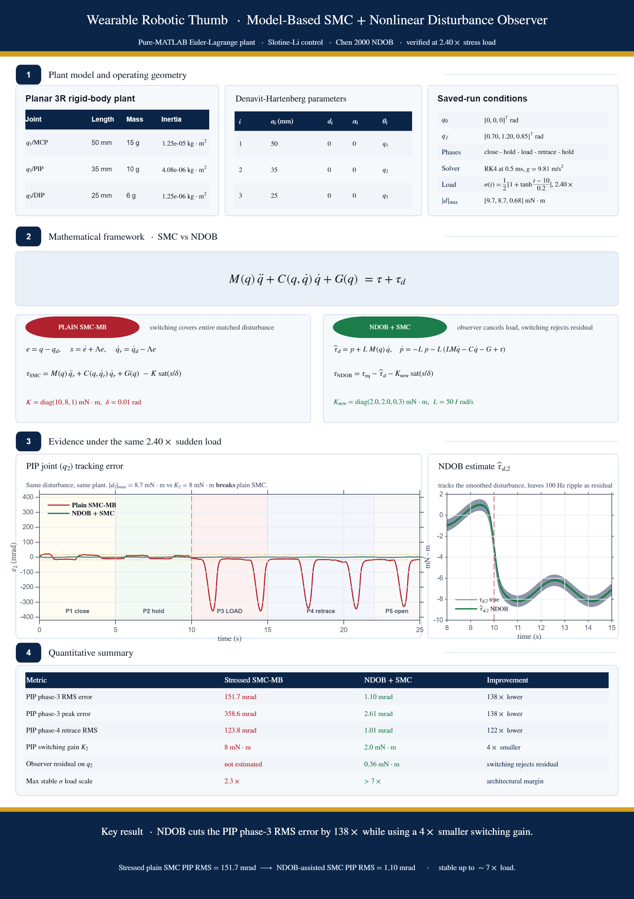
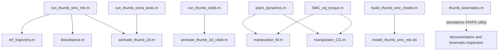
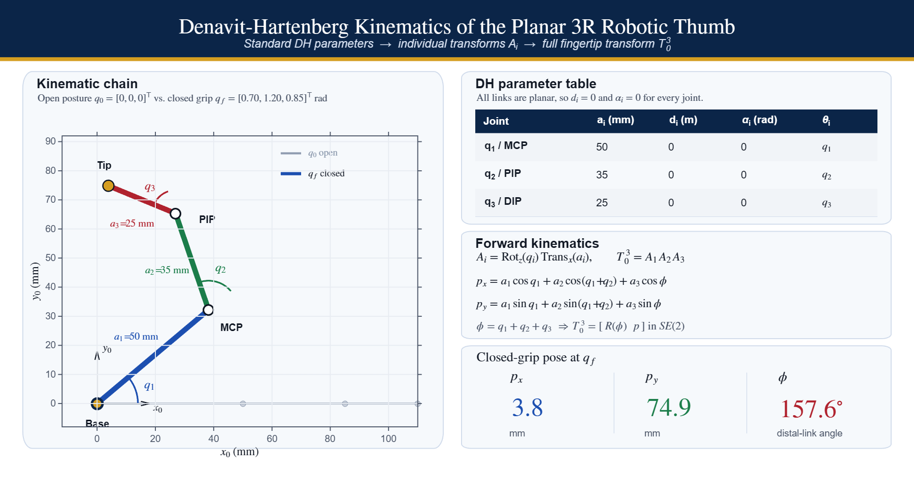
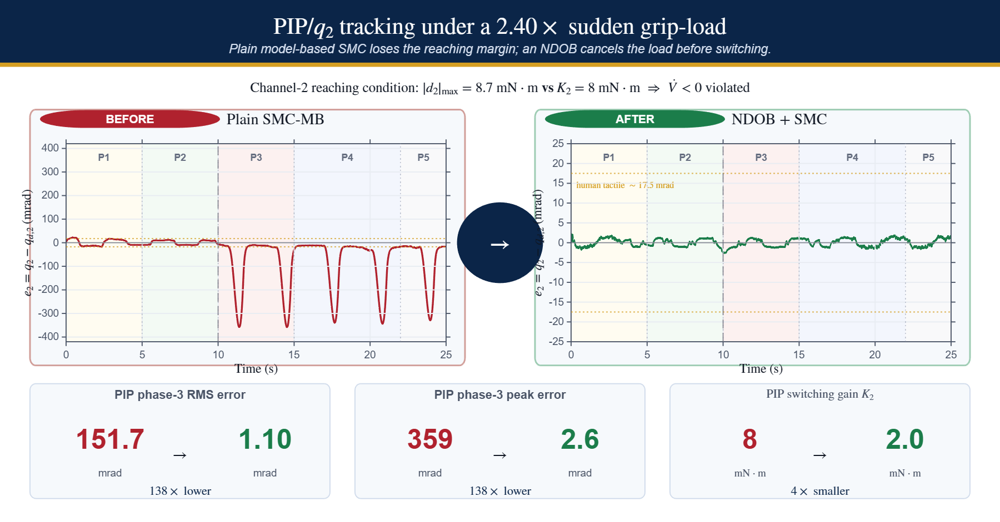
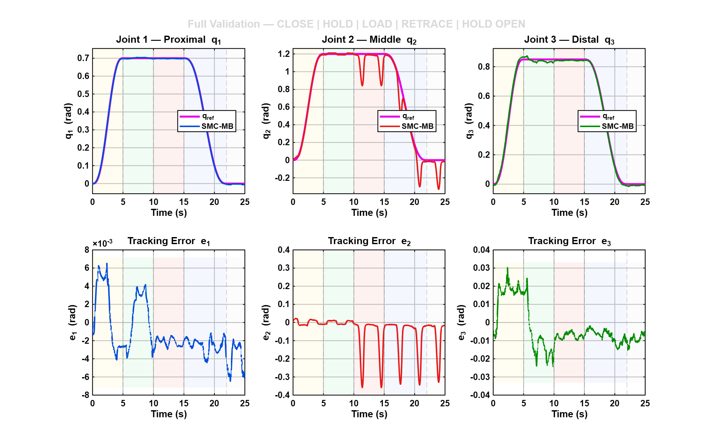
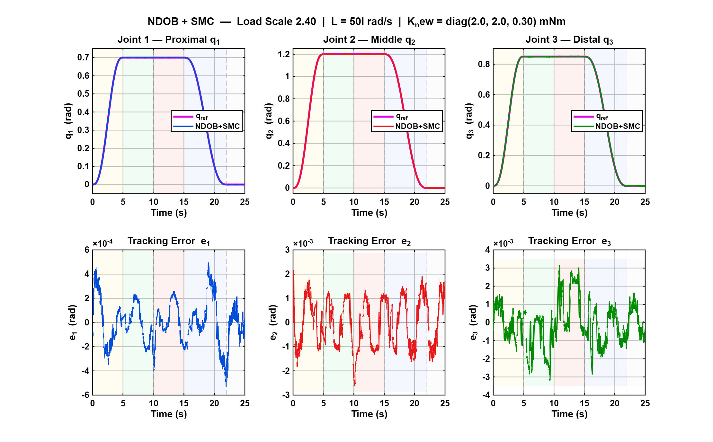
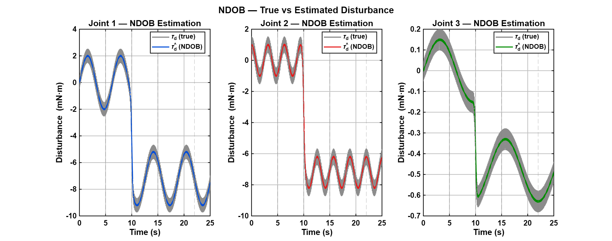

# Wearable Robotic Thumb - Model-Based SMC + Nonlinear Disturbance Observer

<p align="center">
	
</p>

Pure-MATLAB and Simulink study of a 3-DOF wearable robotic thumb exoskeleton. The repository contains an analytic Euler-Lagrange plant model, a Slotine-Li model-based sliding mode controller, and a Chen-style nonlinear disturbance observer. Under the same aggressive 2.40x load case, the NDOB-assisted controller reduces the PIP-joint phase-3 RMS tracking error from 151.7 mrad to 1.10 mrad while using a 4x smaller switching gain on that joint.

For the long-form derivation, development notes, and the full file discussion, see [explanation.md](explanation.md).

---

## What to upload to GitHub

If this becomes its own GitHub repository, the repository root should be the contents of this `Robotic THUMB` folder, not the entire coursework workspace.

### Commit these source files

| Group | Files | Why they matter |
|---|---|---|
| Repository docs | `README.md`, `explanation.md`, `.gitignore` | Landing page, detailed explanation, clean version control |
| Main MATLAB runners | `run_thumb_smc_mb.m`, `run_thumb_extra_tests.m`, `run_thumb_ndob.m` | Main entry points for the plain SMC, stressed validation, and NDOB comparison |
| Shared visualisation | `animate_thumb_2d.m`, `animate_thumb_2d_ndob.m` | Create the thumb animations and live disturbance panels |
| Shared model helpers | `disturbance.m`, `ref_trajectory.m`, `manipulator_M.m`, `manipulator_CG.m`, `thumb_kinematics.m` | Reference, disturbance, analytic dynamics, and standalone DH/FK utility |
| Documentation figure generators | `make_thumb_kinematics_figure.m`, `make_linkedin_beforeafter.m`, `make_linkedin_infographic.m` | Recreate the published documentation and LinkedIn-ready summary figures |
| Simulink path | `plant_dynamics.m`, `SMC_eq_torque.m`, `sat_sign.m`, `build_thumb_smc_model.m`, `model_thumb_smc_mb.slx` | Reference Simulink implementation and its helper functions |
| Tuning utilities | `gain_sweep_fn.m`, `gs_run.m`, `gs_rk4.m` | Parameter sweeps for switching-gain and boundary-layer tuning |

### Commit these PNG files so GitHub renders the README correctly

- `thumb_linkedin_infographic.png`
- `thumb_dh_forward_kinematics.png`
- `thumb_linkedin_beforeafter.png`
- `thumb_fullcycle_tracking.png`
- `thumb_ndob_tracking.png`
- `thumb_ndob_disturbance_est.png`

### Do not commit generated runtime outputs

- `*.mat`
- `*.mp4`
- `*.avi`
- `slprj/`
- `*.slxc`

The code regenerates those outputs locally. They are not required for a new user to run the project from scratch.

---

## How the files are interlinked



Important boundary:

- `thumb_kinematics.m` is **not** used by the three simulation runners.
- `run_thumb_smc_mb.m` calls `ref_trajectory.m`, `disturbance.m`, and `animate_thumb_2d.m`.
- `run_thumb_extra_tests.m` and `run_thumb_ndob.m` use their own internal full-cycle reference and disturbance helpers; they do **not** call `thumb_kinematics.m`, `plant_dynamics.m`, or `SMC_eq_torque.m`.
- `plant_dynamics.m`, `SMC_eq_torque.m`, and `sat_sign.m` belong to the Simulink path together with `build_thumb_smc_model.m` and `model_thumb_smc_mb.slx`.

---

## File-by-file guide

### Main entry points

| File | What it does | Direct dependencies |
|---|---|---|
| `run_thumb_smc_mb.m` | Runs the 15 s plain SMC benchmark and exports the baseline plots | `ref_trajectory.m`, `disturbance.m`, `animate_thumb_2d.m` |
| `run_thumb_extra_tests.m` | Runs the 25 s five-phase stress-test scenario at 2.40x load | `animate_thumb_2d.m`; full-cycle reference and disturbance are defined inside the file |
| `run_thumb_ndob.m` | Runs the NDOB + SMC controller on the same five-phase scenario and exports comparison plots | `animate_thumb_2d_ndob.m`; full-cycle reference and disturbance are defined inside the file |
| `build_thumb_smc_model.m` | Rebuilds the Simulink reference model programmatically | `model_thumb_smc_mb.slx` |

### Dynamics and control helpers

| File | What it does | Used by |
|---|---|---|
| `manipulator_M.m` | Analytic inertia matrix for the 3-link planar thumb | `plant_dynamics.m`, `SMC_eq_torque.m` |
| `manipulator_CG.m` | Coriolis/centrifugal and gravity terms | `plant_dynamics.m`, `SMC_eq_torque.m` |
| `plant_dynamics.m` | Computes joint acceleration for the Simulink plant path | Simulink reference path |
| `SMC_eq_torque.m` | Computes the model-based equivalent torque for the Simulink controller path | Simulink reference path |
| `sat_sign.m` | Boundary-layer saturation helper | Simulink reference path |
| `disturbance.m` | Three-axis external disturbance profile for the plain SMC runner and animation fallback | `run_thumb_smc_mb.m`, animation fallback path |
| `ref_trajectory.m` | Three-phase reference used by the plain SMC runner | `run_thumb_smc_mb.m` |

### Visualisation and documentation

| File | What it does | Notes |
|---|---|---|
| `animate_thumb_2d.m` | Creates the plain-SMC and stressed-SMC animation with the disturbance panel | Called by `run_thumb_smc_mb.m` and `run_thumb_extra_tests.m` |
| `animate_thumb_2d_ndob.m` | Same animation layout but overlays the estimated disturbance | Called by `run_thumb_ndob.m` |
| `thumb_kinematics.m` | Standalone DH/FK utility for fingertip pose, transforms, and joint positions | Not used in the simulation loop |
| `make_thumb_kinematics_figure.m` | Rebuilds the DH/FK presentation figure from `thumb_kinematics.m` | Documentation asset generator |
| `make_linkedin_beforeafter.m` | Rebuilds the stressed-SMC versus NDOB comparison graphic | Documentation asset generator |
| `make_linkedin_infographic.m` | Rebuilds the overview infographic used at the top of the README | Documentation asset generator |
| `thumb_dh_forward_kinematics.png` | Rendered kinematics figure used for documentation/GitHub presentation | Commit if you want README visuals |
| `thumb_linkedin_beforeafter.png` | Rendered summary of stressed SMC vs NDOB recovery | Commit if you want README visuals |
| `thumb_linkedin_infographic.png` | Rendered overview infographic | Commit if you want README visuals |

---

## Plant and controller summary

### Plant parameters

| Link | Length | Mass | Inertia |
|---|---|---|---|
| Proximal link | 50 mm | 15 g | 1.25e-5 kg.m^2 |
| Middle link | 35 mm | 10 g | 4.08e-6 kg.m^2 |
| Distal link | 25 mm | 6 g | 1.25e-6 kg.m^2 |

The centres of mass are placed at half-link length. The kinematic chain is planar, so the standard DH description uses `d_i = 0` and `alpha_i = 0` for every joint.

### Control law used in the pure-MATLAB study

```text
M(q) qdd + C(q,qd) qd + G(q) = tau + tau_d

e   = q - q_ref
s   = edot + Lambda e
tau = tau_eq - K sat(s/delta)
```

Nominal plain-SMC settings:

- `Lambda = diag([12 12 12])`
- `K = diag([10 8 1]) mN.m`
- `delta = 0.01 rad`

NDOB-assisted settings used for the comparison case:

- `L = diag([50 50 50])`
- `K_new = diag([2 2 0.3]) mN.m`

---

## How to run the project from a clean machine

Requirements:

- MATLAB R2021b or later for the pure-MATLAB runners
- Simulink only if you want to open or rebuild the `.slx` model
- No pre-existing `.mat` result files are required; the runners regenerate them

Open MATLAB, move into the repository root, and add the folder to the path:

```matlab
cd('path/to/Robotic THUMB')
addpath(pwd)
```

### 1. Baseline plain SMC benchmark

```matlab
run_thumb_smc_mb
```

Generates:

- `thumb_results.mat`
- `thumb_tracking.png`
- `thumb_velocity.png`
- `thumb_sliding.png`
- `thumb_torques.png`
- `thumb_phase3_reject.png`
- `thumb_animation.mp4`

### 2. Five-phase aggressive-load validation

```matlab
run_thumb_extra_tests
```

Generates:

- `thumb_fullcycle.mat`
- `thumb_fullcycle_tracking.png`
- `thumb_fullcycle_torques.png`
- `thumb_fullcycle_phase.png`
- `thumb_fullcycle_anim.mp4`

### 3. NDOB + SMC comparison

```matlab
run_thumb_ndob
```

Optional custom call:

```matlab
run_thumb_ndob(2.40, [50 50 50], [2.0 2.0 0.3], true)
```

Generates:

- `thumb_ndob_results.mat`
- `thumb_ndob_tracking.png`
- `thumb_ndob_disturbance_est.png`
- `thumb_ndob_animation.mp4`

### 4. Standalone kinematics inspection

```matlab
K = thumb_kinematics([0.70; 1.20; 0.85]);
K.tip_position_mm
K.tip_angle_deg
```

This is useful for documentation and pose inspection. It is not part of the closed-loop simulation path.

### 5. Optional gain sweeps

```matlab
gain_sweep_fn
run gs_run
run gs_rk4
```

If MPEG-4 export is unavailable on the target machine, the simulations still run; only the video export step may warn.

---

## Results and interpretation

The key comparison is plain SMC under the 2.40x five-phase load case versus NDOB + SMC under the same load.

| Metric | Plain SMC | NDOB + SMC | Interpretation |
|---|---|---|---|
| PIP phase-3 RMS error | 151.7 mrad | 1.10 mrad | NDOB restores tight tracking under the same disturbance |
| PIP phase-3 peak error | 358.6 mrad | 2.61 mrad | Peak deviation is dramatically reduced during the sudden-load phase |
| PIP phase-4 retrace RMS | 123.8 mrad | 1.01 mrad | Recovery remains strong after the load event |
| PIP switching gain | 8.0 mN.m | 2.0 mN.m | The observer reduces the switching effort required |
| Residual disturbance on PIP | not estimated | about 0.36 mN.m | The observer cancels most of the external load before switching acts |
| Stable load margin | about 2.3x | greater than 7x | NDOB changes the usable disturbance margin |

Why the plain SMC fails in the stressed case:

```text
Need: K_i > |d_i|_max
```

For the PIP joint in the 2.40x case, the disturbance exceeds the available switching gain. The reaching condition is therefore violated, the sliding surface does not reconverge, and the joint drifts away from the reference during the load phase. The NDOB reduces the residual disturbance seen by the switching term, so the same scenario becomes trackable again with a smaller `K`.

---

## Figures used in this README

### Kinematics summary

<p align="center">
	
</p>

This figure documents the 3R planar thumb geometry, DH parameters, and forward-kinematics structure. It is a documentation asset, not part of the dynamic simulation loop.

### Stressed SMC versus NDOB recovery

<p align="center">
	
</p>

This comparison figure condenses the main claim of the project: under the same aggressive load, plain SMC loses the PIP trajectory while NDOB + SMC keeps the response close to the reference.

### Tracking and observer validation

<p align="center">
	
	
</p>

<p align="center">
	
</p>

These plots show the failure mode and the recovery mechanism directly: the stressed plain-SMC run loses the PIP joint during the sudden-load phase, while the NDOB-based run preserves tracking and produces a disturbance estimate that stays close to the injected load.

---

## Minimal versus full upload

If you want the smallest runnable repository, keep the pure-MATLAB path:

- `run_thumb_smc_mb.m`
- `run_thumb_extra_tests.m`
- `run_thumb_ndob.m`
- `animate_thumb_2d.m`
- `animate_thumb_2d_ndob.m`
- `disturbance.m`
- `ref_trajectory.m`
- `README.md`
- `explanation.md`

If you want the full academic project, also keep:

- `manipulator_M.m`
- `manipulator_CG.m`
- `plant_dynamics.m`
- `SMC_eq_torque.m`
- `sat_sign.m`
- `build_thumb_smc_model.m`
- `model_thumb_smc_mb.slx`
- `gain_sweep_fn.m`
- `gs_run.m`
- `gs_rk4.m`
- `thumb_kinematics.m`
- `make_thumb_kinematics_figure.m`
- `make_linkedin_beforeafter.m`
- `make_linkedin_infographic.m`
- the README PNG assets listed above
