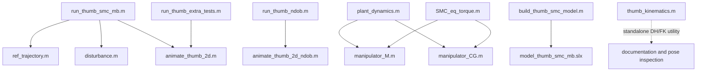

# Wearable Robotic Thumb - Model-Based SMC + Nonlinear Disturbance Observer

<p align="center">
	
</p>

Pure-MATLAB and Simulink study of a 3-DOF wearable robotic thumb exoskeleton. The repository contains an analytic Euler-Lagrange plant model, a Slotine-Li model-based sliding mode controller, and a Chen-style nonlinear disturbance observer. Under the same aggressive 2.40x load case, the NDOB-assisted controller reduces the PIP-joint phase-3 RMS tracking error from 151.7 mrad to 1.10 mrad while using a 4x smaller switching gain on that joint.

For the long-form derivation, development notes, and the full mathematical discussion, see [explanation.md](explanation.md).

---

## Repository contents

| Group | Files | Purpose |
|---|---|---|
| Documentation | `README.md`, `explanation.md`, `.gitignore` | Project overview, derivation notes, and clean repo rules |
| Main MATLAB runners | `run_thumb_smc_mb.m`, `run_thumb_extra_tests.m`, `run_thumb_ndob.m` | Baseline SMC, aggressive-load failure case, and NDOB recovery case |
| Shared visualisation | `animate_thumb_2d.m`, `animate_thumb_2d_ndob.m` | Animation and disturbance-panel rendering |
| Shared model helpers | `disturbance.m`, `ref_trajectory.m`, `manipulator_M.m`, `manipulator_CG.m`, `thumb_kinematics.m` | Reference generation, disturbances, analytic dynamics, and standalone kinematics |
| Simulink reference path | `plant_dynamics.m`, `SMC_eq_torque.m`, `sat_sign.m`, `build_thumb_smc_model.m`, `model_thumb_smc_mb.slx` | Simulink implementation of the same control idea |
| Tuning utilities | `gain_sweep_fn.m`, `gs_run.m`, `gs_rk4.m` | Parameter sweeps for switching-gain and boundary-layer studies |
| README media assets | `thumb_linkedin_infographic.png`, `thumb_dh_forward_kinematics.png`, `thumb_linkedin_beforeafter.png`, `thumb_fullcycle_tracking.png`, `thumb_ndob_tracking.png`, `thumb_ndob_disturbance_est.png`, `thumb_fullcycle_anim.mp4`, `thumb_ndob_animation.mp4` | Visual outputs embedded in this page |

---

## How the files are interlinked



Important boundary:

- `thumb_kinematics.m` is **not** used by the three simulation runners.
- `run_thumb_smc_mb.m` calls `ref_trajectory.m`, `disturbance.m`, and `animate_thumb_2d.m`.
- `run_thumb_extra_tests.m` and `run_thumb_ndob.m` use internal full-cycle reference and disturbance helpers; they do **not** call `thumb_kinematics.m`, `plant_dynamics.m`, or `SMC_eq_torque.m`.
- `plant_dynamics.m`, `SMC_eq_torque.m`, and `sat_sign.m` belong to the Simulink path together with `build_thumb_smc_model.m` and `model_thumb_smc_mb.slx`.

---

## Model summary

### Plant parameters

| Link | Length | Mass | Inertia |
|---|---|---|---|
| Proximal link | 50 mm | 15 g | 1.25e-5 kg.m^2 |
| Middle link | 35 mm | 10 g | 4.08e-6 kg.m^2 |
| Distal link | 25 mm | 6 g | 1.25e-6 kg.m^2 |

The centres of mass are placed at half-link length. The kinematic chain is planar, so the standard DH description uses `d_i = 0` and `alpha_i = 0` for every joint.

### Control law used in the pure-MATLAB study

```text
M(q) qdd + C(q,qd) qd + G(q) = tau + tau_d

e   = q - q_ref
s   = edot + Lambda e
tau = tau_eq - K sat(s/delta)
```

Nominal plain-SMC settings:

- `Lambda = diag([12 12 12])`
- `K = diag([10 8 1]) mN.m`
- `delta = 0.01 rad`

NDOB-assisted settings used for the comparison case:

- `L = diag([50 50 50])`
- `K_new = diag([2 2 0.3]) mN.m`

---

## How to run the project from a clean machine

Requirements:

- MATLAB R2021b or later for the pure-MATLAB runners
- Simulink only if you want to open or rebuild the `.slx` model
- No pre-existing `.mat` result files are required; the runners regenerate them

Open MATLAB, move into the repository root, and add the folder to the path:

```matlab
cd('path/to/Robotic THUMB')
addpath(pwd)
```

### 1. Baseline plain SMC benchmark

```matlab
run_thumb_smc_mb
```

Generates `thumb_results.mat`, `thumb_tracking.png`, `thumb_velocity.png`, `thumb_sliding.png`, `thumb_torques.png`, `thumb_phase3_reject.png`, and `thumb_animation.mp4`.

### 2. Five-phase aggressive-load validation

```matlab
run_thumb_extra_tests
```

Generates `thumb_fullcycle.mat`, `thumb_fullcycle_tracking.png`, `thumb_fullcycle_torques.png`, `thumb_fullcycle_phase.png`, and `thumb_fullcycle_anim.mp4`.

### 3. NDOB + SMC comparison

```matlab
run_thumb_ndob
```

Optional custom call:

```matlab
run_thumb_ndob(2.40, [50 50 50], [2.0 2.0 0.3], true)
```

Generates `thumb_ndob_results.mat`, `thumb_ndob_tracking.png`, `thumb_ndob_disturbance_est.png`, and `thumb_ndob_animation.mp4`.

### 4. Standalone kinematics inspection

```matlab
K = thumb_kinematics([0.70; 1.20; 0.85]);
K.tip_position_mm
K.tip_angle_deg
```

This is useful for documentation and pose inspection. It is not part of the closed-loop simulation path.

### 5. Optional gain sweeps

```matlab
gain_sweep_fn
run gs_run
run gs_rk4
```

If MPEG-4 export is unavailable on the target machine, the simulations still run; only the video export step may warn.

---

## Results at a glance

The key comparison is plain SMC under the 2.40x five-phase load case versus NDOB + SMC under the same load.

| Metric | Plain SMC | NDOB + SMC | Interpretation |
|---|---|---|---|
| PIP phase-3 RMS error | 151.7 mrad | 1.10 mrad | NDOB restores tight tracking under the same disturbance |
| PIP phase-3 peak error | 358.6 mrad | 2.61 mrad | Peak deviation collapses from large drift to near-reference motion |
| PIP phase-4 retrace RMS | 123.8 mrad | 1.01 mrad | Recovery stays accurate even after the disturbance phase |
| PIP switching gain | 8.0 mN.m | 2.0 mN.m | The observer reduces the switching effort required |
| Residual disturbance on PIP | not estimated | about 0.36 mN.m | Most of the external load is cancelled before switching acts |
| Stable load margin | about 2.3x | greater than 7x | NDOB materially expands the disturbance margin |

Why the plain SMC fails in the stressed case:

```text
Need: K_i > |d_i|_max
```

For the PIP joint in the 2.40x case, the disturbance exceeds the available switching gain. The reaching condition is violated, the sliding surface does not reconverge, and the joint drifts away from the reference during the load phase. The NDOB reduces the residual disturbance seen by the switching term, so the same scenario becomes trackable again with a smaller `K`.

---

## Two key output videos

Watch these first. Both runs use the same aggressive load case. The left video shows the plain SMC stress test, and the right video shows the NDOB-assisted run under the same disturbance profile.

<p align="center">
	<video src="thumb_fullcycle_anim.mp4" controls preload="metadata" width="48%"></video>
	<video src="thumb_ndob_animation.mp4" controls preload="metadata" width="48%"></video>
</p>

<p align="center">
	<a href="thumb_fullcycle_anim.mp4">Plain SMC under 2.40x load</a>
	|
	<a href="thumb_ndob_animation.mp4">NDOB + SMC under the same load</a>
</p>

What to look for:

- In the plain-SMC video, the thumb departs visibly from the intended closed-grip path during the disturbance phase and does not recover tightly on retrace.
- In the NDOB video, the thumb stays close to the reference envelope through the same disturbance interval because the observer removes most of the load before the switching term has to react.

---

## Figures in reading order

### 1. Kinematic context

<p align="center">
	
</p>

Start with this figure. It fixes the geometry, DH parameters, and fingertip pose used throughout the rest of the project. The point of this figure is not control performance; it establishes the 3R planar thumb model, the link dimensions, and the forward-kinematics mapping that makes the motion plots interpretable.

### 2. Failure case: plain SMC under aggressive load

<p align="center">
	
</p>

This is the primary failure figure. Read it phase by phase. The first two phases show that the controller is fine in nominal closing and holding. The third phase is the real stress test: once the 2.40x load is applied, the PIP joint loses the sliding condition and the red trace departs strongly from the reference. The fourth and fifth phases show that the resulting error persists into retrace and reopening rather than disappearing immediately.

### 3. Recovery case: NDOB + SMC under the same load

<p align="center">
	
	
</p>

These two figures explain both the outcome and the mechanism. The tracking plot shows that the matched NDOB run remains close to the reference across all five phases, including the same disturbance window that broke the plain controller. The disturbance-estimation plot explains why: the observer tracks the injected load closely enough that the residual disturbance seen by the switching term stays small.

### 4. Compressed summary of the result

<p align="center">
	
</p>

This figure is the short version of the full story. It compresses the failure and recovery comparison into one page: the left side captures the plain-SMC breakdown, the right side captures the NDOB recovery, and the KPIs quantify the change rather than leaving it as a visual impression.

---

## Full output map and what each figure means

| Output file | Produced by | How to read it |
|---|---|---|
| `thumb_tracking.png` | `run_thumb_smc_mb` | Baseline joint-angle tracking over the 3-phase reference. This is the nominal sanity-check figure showing that the controller tracks well before any aggressive stress test is applied. |
| `thumb_velocity.png` | `run_thumb_smc_mb` | Joint velocities for the same nominal run. Use it to check whether transitions are smooth and whether phase changes create unrealistic spikes. |
| `thumb_sliding.png` | `run_thumb_smc_mb` | Sliding-surface evolution during the baseline run. This figure shows whether the state reaches and stays near the boundary layer as intended. |
| `thumb_torques.png` | `run_thumb_smc_mb` | Actuation demand in the baseline case. Use it to understand how much effort is needed when the plant is not heavily disturbed. |
| `thumb_phase3_reject.png` | `run_thumb_smc_mb` | Zoomed disturbance-rejection view of the nominal 3-phase run. This isolates the most relevant segment of the baseline controller. |
| `thumb_animation.mp4` | `run_thumb_smc_mb` | Motion playback for the nominal SMC case with the disturbance panel. This is the easiest way to see the unforced baseline behavior in time. |
| `thumb_fullcycle_tracking.png` | `run_thumb_extra_tests` | Main aggressive-load failure figure. Focus on the PIP trace in the load, retrace, and hold-open phases. |
| `thumb_fullcycle_torques.png` | `run_thumb_extra_tests` | Actuation demand during the aggressive-load test. Read this together with the tracking failure to judge how much control effort is being spent without restoring tight tracking. |
| `thumb_fullcycle_phase.png` | `run_thumb_extra_tests` | Sliding surfaces and phase-plane behaviour for the stressed plain-SMC run. This figure helps explain the loss of reconvergence dynamically rather than only kinematically. |
| `thumb_fullcycle_anim.mp4` | `run_thumb_extra_tests` | Video view of the stressed plain-SMC run. The physical deviation from the intended posture is clearer here than in the plots alone. |
| `thumb_ndob_tracking.png` | `run_thumb_ndob` | Main recovery figure. It should be read directly against `thumb_fullcycle_tracking.png` because the scenario is intentionally matched. |
| `thumb_ndob_disturbance_est.png` | `run_thumb_ndob` | Mechanism figure for the observer. It shows whether the disturbance estimate is close enough to the injected load to justify the reduced switching gain. |
| `thumb_ndob_animation.mp4` | `run_thumb_ndob` | Video view of the NDOB-assisted run. It is the motion-level confirmation that the observer changes the actual behaviour, not only the plotted error metrics. |
| `thumb_dh_forward_kinematics.png` | documentation asset | Kinematic and DH summary for the 3R thumb model. Read this before the control results if you want the geometry context. |
| `thumb_linkedin_beforeafter.png` | documentation asset | Condensed failure-versus-recovery summary with headline KPIs. Good as the quick executive figure after the detailed plots. |
| `thumb_linkedin_infographic.png` | documentation asset | One-page overview of the entire project: plant, controller, stress test, and results. |
